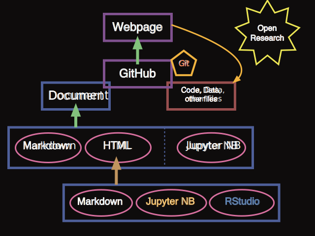

# Publishing Research as Online with GitHub

<!-- MarkdownTOC -->

1. [Introduction](#introduction)
	1. [Workshop Ethos at ResPlat](#workshop-ethos-at-resplat)
	1. [Elements of Publishing with GitHub](#elements-of-publishing-with-github)
1. [Steps to Publish](#steps-to-publish)
	1. [GitHub Repositories](#github-repositories)
	1. [Documents for Web-pages Introduction](#documents-for-web-pages-introduction)
	1. [Documents for Web-pages Pt I \(Markdown\)](#documents-for-web-pages-pt-i-markdown)
		1. [Basic Markdown Syntax Example](#basic-markdown-syntax-example)
		1. [Cheat Sheets](#cheat-sheets)
		1. [Multiple Pages in your webpage](#multiple-pages-in-your-webpage)
		1. [Downloading Files](#downloading-files)
	1. [Documents for Web-pages Pt II \(HTML, Jupyter, RStudio\)](#documents-for-web-pages-pt-ii-html-jupyter-rstudio)
		1. [Jupyter](#jupyter)
	1. [Linking to Data and other Files](#linking-to-data-and-other-files)
1. [Zenodo DOI and Archiving](#zenodo-doi-and-archiving)
	1. [MeetUp Plan](#meetup-plan)
	1. [General Idea](#general-idea)
	1. [GitHub + Markdown](#github--markdown)
	1. [Figshare](#figshare)
	1. [Python, R and Matlab](#python-r-and-matlab)
		1. [Python](#python)
		1. [R](#r)
		1. [Matlab](#matlab)
	1. [Going Further](#going-further)

<!-- /MarkdownTOC -->


# Introduction

## Workshop Ethos at ResPlat


* Technically empower researchers
	* Programming
	* Open Source
	* Practical

* Connect researchers to form a community
	* **openness**, 
	* **friendliness**, 
	* **helpfulness**
	* [Facebook Group](https://www.facebook.com/groups/522053638172827/)
	* [My (Errol) Twitter](https://twitter.com/maegul)


## Elements of Publishing with GitHub




# Steps to Publish

1. Make Repository on GitHub
1. Make (appropriate) Document
1. Add Document to GitHub
1. Publish


## GitHub Repositories


**Basic Idea**

<!-- Gif of creating a Repo and adding files and editing -->

* A repository is an online folder
	* GitHub enables you to exercise version control with git on this folder, if you wish.
* It is public and shareable across GitHub ... this is part of the *Open Science* ethos of GitHub
	* You have options to make your repository private if you wish.
* You can add files and edit them manually (see gif)
	* Part of the utility of using git is that enables easy synchronisation with GitHub.
	* Note that when editing, GitHub will keep every version you make (*as it runs git version control too*)

**Notes**

* The way you create a Repository depends on whether you're using git or not
	* If you are not using git with this repository, **be sure to add a Readme file with the checkbox**
	* If you are going to use git with this, **do not add the readme file, as it will cause problems later**.


## Documents for Web-pages Introduction

<!-- gif of writing markdown, making webpage and changing theme (don't show webpage) -->
* To make a webpage, **your file needs to an appropriate kind of document**
* Two kinds of document: **Markdown** and **HTML**.
	* **Markdown** is a simple format and syntax, makes for quick and easy document and webpage writing.
	* **HTML** is a powerful way of writing webpages.  It is the *raw code of the web* really, and so, if you want to learn it, you will be able to make anything you want on the web.
	* Most of the time, you'll either use markdown directly, or convert markdown into HTML so that you won't have to ever learn it.
	* **Jupyter Notebooks**
		* GitHub will display a notebook file (`.ipynb`) automatically for you.  Handy!
		* This only happens when viewing the file from within the GitHub webpage, not the webpage that it makes for you.
* Document File Name
	* The file name that GitHub is looking for is **index**.
	* You must have either an `index.md` file or a `index.html` file.  This will be used to create your web page.
	* An alternative is a `README.md`, which will be used if there is no `index.md`	


## Documents for Web-pages Pt I (Markdown)

<!-- gif of writing quick markdown, making webpage and changing theme (don't show webpage) -->


### Basic Markdown Syntax Example

**Examples of Markdown**

```markdown
This is all about just typing text.

With markdown, you just type.

**This will be bold**

*This is italicised*
```

This is all about just typing text.

With markdown, you just type.

**This will be bold**

*This is italicised*

---


```markdown
* I am a dot point
	* This will be a sub dot point

1. This will be a numbered dot point
1. This will be point number **2**
	1. A sub point
	1. the second sub point
```

* I am a dot point
	* This will be a sub dot point

1. This will be a numbered dot point
1. This will be point number **2**
	1. A sub point
	1. the second sub point

---


```markdown
[This is a link](wwww.google.com)


> this is a quote

`if code == True: render(code)`
```

[This is a link](wwww.google.com)


> this is a quote

`if code == True: render(code)`


### Cheat Sheets

[Good Cheat SHeet](https://github.com/adam-p/markdown-here/wiki/Markdown-Cheatsheet)

[GitHub Guide (incl GHM)](https://help.github.com/articles/basic-writing-and-formatting-syntax/)

* GitHub have their own customised version of Markdown with a few extra features.
	* When you want GitHub to use your markdown directly to make a webpage, refer to the above cheat sheet.
	* If you're using markdown to be converted to HTML by some other mechanism (there are many!), then refer to the top cheat sheet or the reference associated with whatever program you're using to convert the markdown.


[Original Markdown Cheat Sheet](https://daringfireball.net/projects/markdown/basics)


### Multiple Pages in your webpage

* In the above examples of markdown, you learnt how to link to another webpage.

[For example ... This is a link to google](wwww.google.com)

* If you wish, using the same syntax, you can link to any other file in your GitHub repository
* **SO LONG as that file is an appropriate file for making webpages**

**So, the following Markdown ...**

```markdown
[Here is a link to a Jupyter Notebook in HTML format](./other_documents/MyNotebook.html)
```

**creates these links:**


[Here is a link to a Jupyter Notebook in HTML format](./other_documents/MyNotebook.html)

### Downloading Files

* Links to files not appropriate to be made into web pages will simply download the files.
	* Generally, if you wish for users to download your files, a link back to the GitHub repository the web-page originates from will usually be good enough, as it is easy to download single files, or the whole repository.
	* **Nonetheless**, you may wish for a user to download a specific file directly from the webpage.

```markdown
[Download a Jupyter Notebook in raw `ipynb` format](./other_documents/MyNotebook.ipynb)

[Download the markdown that made this web page](https://raw.githubusercontent.com/maegul/publishing_materials/master/index.md)
```

[Download a Jupyter Notebook in raw `ipynb` format](./other_documents/MyNotebook.ipynb)

[Download the markdown that made this web page](https://raw.githubusercontent.com/maegul/publishing_materials/master/index.md)

**Notes**

* Note, how the link to the `index.md` file was done.
	* Ordinarily, GitHub would make the index.md file as a webpage.
	* To download the raw file, a service that GitHub provides, which allows, must be used.
	* You can see from the URL how you get the raw content for any file.  If you want to get this URL for any file, navigate to that file in the GitHub web-page, and fine in the top right a `Raw` button, which will take you to this URL.
	* The Download link will take you directly to the raw format of the file, which can then be saved by your browser.


## Documents for Web-pages Pt II (HTML, Jupyter, RStudio)

* HTML files can be generated from Jupyter Notebooks and RStudio

### Jupyter

* Jupyter notebooks allow you to use markdown and latex maths directly in them, as well as the other coding elements
* 

[test](other_documents/test.html)

Jupyter Notebook

Jupyter Export

Reveal?


## Linking to Data and other Files

GitHub link of webpage

Linking directly to files

FigShare for big data

[what](https://raw.githubusercontent.com/maegul/configs/master/.bash_profile)


# Zenodo DOI and Archiving


## MeetUp Plan
* GitHub
    * Repo
    * Adding files etc
    * Plug git integration
* Markdown
    * Quick example + render
    * Quick example + 
    	* GitHub pages + 
    	* themes
    * General markdown syntax
    	* github flavour
    	* linking to other pages
    	* index and readme file names
* HTML
	* jupyter notebooks
		* as themselves 
		HTML
	* RStudio RMarkDown and BookDown


## General Idea
* Focus on basics of github pages and markdown.
* Show possibility of getting more complex with programming language specific possibilities, which may not be appropriate for OpenRes, but for exploration later on.


## GitHub + Markdown

[Good Cheat SHeet](https://github.com/adam-p/markdown-here/wiki/Markdown-Cheatsheet)

[GitHub Guide (incl GHM)](https://help.github.com/articles/basic-writing-and-formatting-syntax/)

[Original Markdown Cheat Sheet](https://daringfireball.net/projects/markdown/basics)

This is some text
And this is some more.


[putting a repo online](https://maegul.github.io/DataViz_web_plotly_cheat_sheet/github_pages_gif.html)

* GitHub Basics
	* Account
	* Repo
		* readme (what this is/contains)
		* data (making sure credit/source is included)
		* code (commented)
		* explanation (written text, containing motivation for project, analysis/interpretation of code results and any inferences/conclusions)
	* Uploading files
		* Show git versioning
	* Store and Share Code
		* Forking, downloading, Commenting through issues
* Markdown 
	* Basic README.md example + Basic Markdown syntax
		* Heading; dot points; links; images
	* github flavoured markdown -> syntax highlighting
	* Using github pages
		* Settings to make github page
		* appropriate file names - index / readme
		* Themes (Jekyll)
		* linking to other pages


## Figshare
* Basic introduction to figshare
	* For larger data (and larger file sizes)
	* Give data a DOI (useful for citations)
	* Free
	* Unimelb account is better

* [Web Page](https://figshare.com)
* [Melbourne Figshare](https://melbourne.figshare.com)


## Python, R and Matlab
* Basic idea that markdown, as above, supported and used by these other coding environments too.
* Or, taking it further, can generate a file, such as HTML, that can live on github and be easily viewed.


### Python
* Save as HTML / Rendered on GitHub 
	* NBViewer as an alternative.
* [nbconvert](https://nbconvert.readthedocs.io/en/latest/index.html)
	* HTML
	* HTML + Template (Plugins)
	* slides 


### R
* RStudio Tools [webpage with tutorial and docs](http://rmarkdown.rstudio.com/index.html)
* RMarkdown
* Knitr + Code insertions -> HTML files
* Notebook (?)
* Slides and other Magic (?!)


### Matlab
* [Publish Matlab code](https://au.mathworks.com/help/matlab/matlab_prog/publishing-matlab-code.html)
* [Markup language](https://au.mathworks.com/help/matlab/matlab_prog/marking-up-matlab-comments-for-publishing.html)


## Going Further
* For Demo purposes
* Dashboards (Shiny, Dash, HTML widget and plug ins)
* Javascript and web dev
