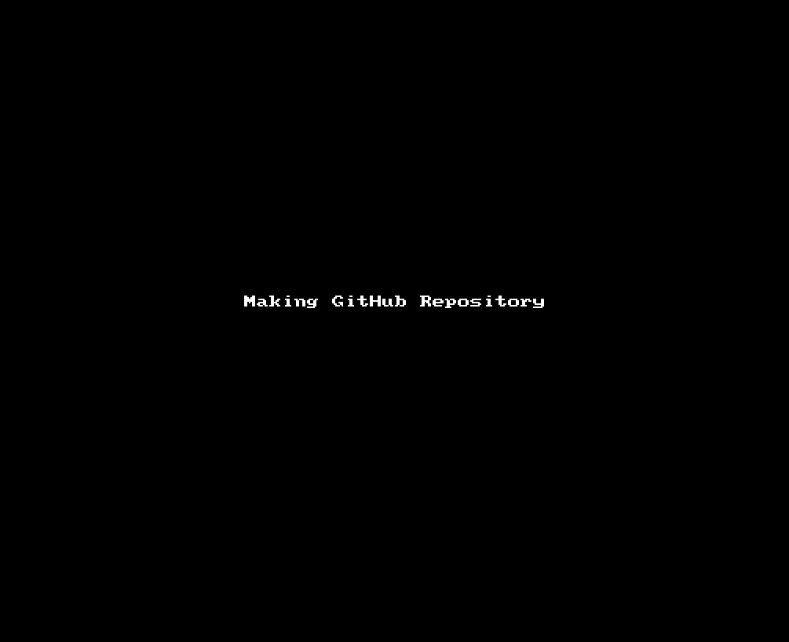
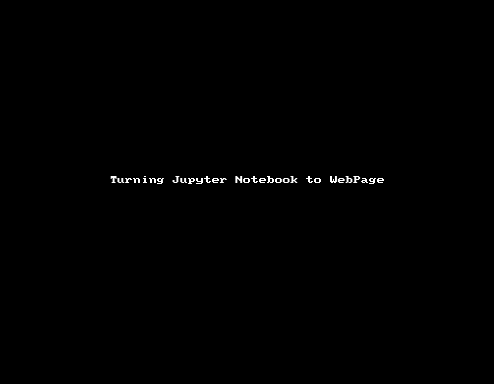
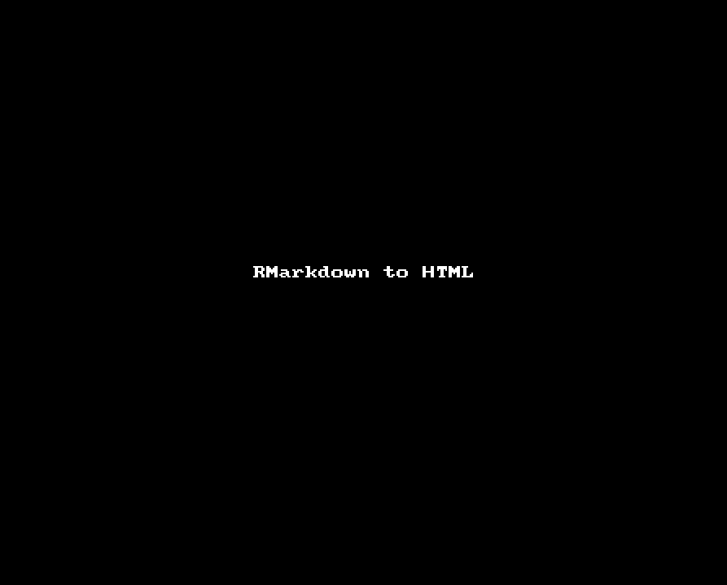

# Publishing Research Online as Webpages with GitHub

<!-- MarkdownTOC -->

1. [Introduction](#introduction)
	1. [Workshop Ethos at ResPlat](#workshop-ethos-at-resplat)
	1. [Elements of Publishing with GitHub](#elements-of-publishing-with-github)
1. [Steps to Publish](#steps-to-publish)
	1. [GitHub Repositories](#github-repositories)
	1. [Documents for Web-pages Introduction](#documents-for-web-pages-introduction)
	1. [Documents for Web-pages Pt I \(Markdown\)](#documents-for-web-pages-pt-i-markdown)
		1. [Basic Markdown Syntax Examples](#basic-markdown-syntax-examples)
		1. [Cheat Sheets](#cheat-sheets)
		1. [Multiple Pages in your webpage](#multiple-pages-in-your-webpage)
		1. [Downloading Files](#downloading-files)
	1. [Documents for Web-pages Pt II \(HTML, Jupyter, RStudio\)](#documents-for-web-pages-pt-ii-html-jupyter-rstudio)
		1. [Jupyter](#jupyter)
		1. [RStudio](#rstudio)
		1. [Matlab](#matlab)
1. [Zenodo DOI and Archiving](#zenodo-doi-and-archiving)
1. [Large Data Files with Figshare](#large-data-files-with-figshare)

<!-- /MarkdownTOC -->


# Introduction

## Workshop Ethos at ResPlat


* Technically empower researchers
	* Programming
	* Open Source
	* Practical

* Connect researchers to form a community
	* **openness**, 
	* **friendliness**, 
	* **helpfulness**
	* [Facebook Group](https://www.facebook.com/groups/522053638172827/)
	* [My (Errol) Twitter](https://twitter.com/maegul)


## Elements of Publishing with GitHub


# Steps to Publish

1. Make Repository on GitHub
1. Make (appropriate) Document
1. Add Document to GitHub
1. Publish


## GitHub Repositories


**Basic Idea**




* A repository is an online folder
	* GitHub enables you to exercise version control with git on this folder, if you wish.
* It is public and shareable across GitHub ... this is part of the *Open Science* ethos of GitHub
	* You have options to make your repository private if you wish.
* You can add files and edit them manually (see gif)
	* Part of the utility of using git is that enables easy synchronisation with GitHub.
	* Note that when editing, GitHub will keep every version you make (*as it runs git version control too*)

**Notes**

* The way you create a Repository depends on whether you're using git or not
	* If you are not using git with this repository, **be sure to add a Readme file with the checkbox**
	* If you are going to use git with this, **do not add the readme file, as it will cause problems later**.


## Documents for Web-pages Introduction

**Writing Markdown**


**Turning Markdown into a webpage on GitHub**


* To make a webpage, **your file needs to an appropriate kind of document**
* Two kinds of document: **Markdown** and **HTML**.
	* **Markdown** is a simple format and syntax, makes for quick and easy document and webpage writing.
	* **HTML** is a powerful way of writing webpages.  It is the *raw code of the web* really, and so, if you want to learn it, you will be able to make anything you want on the web.
	* Most of the time, you'll either use markdown directly, or convert markdown into HTML so that you won't have to ever learn it.
	* **Jupyter Notebooks**
		* GitHub will display a notebook file (`.ipynb`) automatically for you.  Handy!
		* This only happens when viewing the file from within the GitHub webpage, not the webpage that it makes for you.
* Document File Name
	* The file name that GitHub is looking for is **index**.
	* You must have either an `index.md` file or a `index.html` file.  This will be used to create your web page.
	* An alternative is a `README.md`, which will be used if there is no `index.md`	


## Documents for Web-pages Pt I (Markdown)


### Basic Markdown Syntax Examples

**Examples of Markdown**

```markdown
This is all about just typing text.

With markdown, you just type.

**This will be bold**

*This is italicised*
```

This is all about just typing text.

With markdown, you just type.

**This will be bold**

*This is italicised*

---


```markdown
* I am a dot point
	* This will be a sub dot point

1. This will be a numbered dot point
1. This will be point number **2**
	1. A sub point
	1. the second sub point
```

* I am a dot point
	* This will be a sub dot point

1. This will be a numbered dot point
1. This will be point number **2**
	1. A sub point
	1. the second sub point

---


```markdown
[This is a link](wwww.google.com)


> this is a quote

`if code == True: render(code)`
```

[This is a link](http://www.google.com)


> this is a quote

`if code == True: render(code)`


### Cheat Sheets

[Good Cheat SHeet](https://github.com/adam-p/markdown-here/wiki/Markdown-Cheatsheet)

[GitHub Guide (incl GHM)](https://help.github.com/articles/basic-writing-and-formatting-syntax/)

* GitHub have their own customised version of Markdown with a few extra features.
	* When you want GitHub to use your markdown directly to make a webpage, refer to the above cheat sheet.
	* If you're using markdown to be converted to HTML by some other mechanism (there are many!), then refer to the top cheat sheet or the reference associated with whatever program you're using to convert the markdown.


[Original Markdown Cheat Sheet](https://daringfireball.net/projects/markdown/basics)


### Multiple Pages in your webpage

* In the above examples of markdown, you learnt how to link to another webpage.

[For example ... This is a link to google](wwww.google.com)

* If you wish, using the same syntax, you can link to any other file in your GitHub repository
* **SO LONG as that file is an appropriate file for making webpages**

**So, the following Markdown ...**

```markdown
[Here is a link to a Jupyter Notebook in HTML format](./other_documents/MyNotebook.html)
```

**creates these links:**

[Here is a link to a Jupyter Notebook in HTML format](./other_documents/MyNotebook.html)

### Downloading Files

* Links to files not appropriate to be made into web pages will simply download the files.
	* Generally, if you wish for users to download your files, a link back to the GitHub repository the web-page originates from will usually be good enough, as it is easy to download single files, or the whole repository.
	* **Nonetheless**, you may wish for a user to download a specific file directly from the webpage.

```markdown
[Download a Jupyter Notebook in raw `ipynb` format](./other_documents/MyNotebook.ipynb)

[Download the markdown that made this web page](https://raw.githubusercontent.com/maegul/publishing_materials/master/index.md)
```

[Download a Jupyter Notebook in raw `ipynb` format](./other_documents/MyNotebook.ipynb)

[Download the markdown that made this web page](https://raw.githubusercontent.com/maegul/publishing_materials/master/index.md)

**Notes**

* Note, how the link to the `index.md` file was done.
	* Ordinarily, GitHub would make the index.md file as a webpage.
	* To download the raw file, a service that GitHub provides, which allows, must be used.
	* You can see from the URL how you get the raw content for any file.  If you want to get this URL for any file, navigate to that file in the GitHub web-page, and fine in the top right a `Raw` button, which will take you to this URL.
	* The Download link will take you directly to the raw format of the file, which can then be saved by your browser.


## Documents for Web-pages Pt II (HTML, Jupyter, RStudio)

* HTML files can be generated from Jupyter Notebooks and RStudio

### Jupyter

**Animation of Producing HTML from Jupyter Notebook**



* You can export any notebook as an HTML file.
* Put this file into your GitHub Repo
	* If you want to link to this file from your main page, simply do so, probably using markdown
	* **NOTE:** If you want this notebook as an html file to be your main page, you will have to change its file name to `index.html`.	 


**Notes**


* GitHub will render Jupyter Notebook files directly, when viewed directly through the GitHub webpage.
* Jupyter notebooks allow you to use markdown, as well as the other coding elements and embedding tricks, directly in them.  You can get a rich document with this.
* There's also a powerful tool for converting notebooks to other formats: `jupyter nbconvert`
	* [Webpage and Documentation](https://nbconvert.readthedocs.io/en/latest/)
	* *example:* `nbconvert --to html --template full my_notebook.ipynb`
	* Other formats include:
		* PDF
		* Markdown
		* Slide show (also see RISE)


[Download the example Jupyter Notebook from the gif](other_documents/MyNotebook.ipynb)

[See the HTML webpage produced from the above notebook](other_documents/MyNotebook.html)


### RStudio

**Animation of Producing HTML from RMarkdown**




* RStudio Tools [webpage with tutorial and docs](http://rmarkdown.rstudio.com/index.html)
* Process:
	* Knitr + Code insertions -> HTML files
	* **See animation below**


[Download the Example of an RMarkdown.md File from the gif](other_documents/MyRMarkdown.Rmd)

[See the HTML webpage produced with the above file and KnitR](other_documents/MyRMarkdown.html)


### Matlab

* [Publish Matlab code](https://au.mathworks.com/help/matlab/matlab_prog/publishing-matlab-code.html)
* [Markup language](https://au.mathworks.com/help/matlab/matlab_prog/marking-up-matlab-comments-for-publishing.html)


# Zenodo DOI and Archiving

**Make your repository citable**

[GitHub Guide to making your code citable](https://guides.github.com/activities/citable-code/)

[Zenodo HomePage](https://zenodo.org)

* The GitHub Guide outlines the steps involved
* The process involves: 
	* telling Zenodo to create an archived copy of one of your repositories.
	* Telling Zenodo to create a citable DOI for your repository.


# Large Data Files with Figshare

* For larger data (and larger file sizes)
	* Up to 100GB storage, and max file size ~ 10-20GB
* Similar to Zenodo, in that you create a citable / published snapshot of data
* Give data a DOI (useful for citations)

* [Web Page](https://figshare.com)
* [Melbourne Figshare](https://melbourne.figshare.com)


